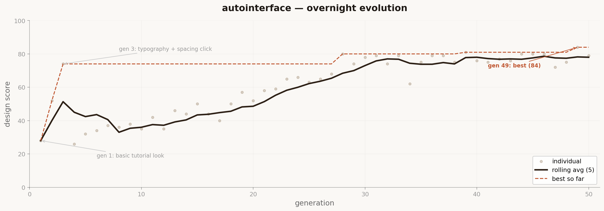

# autointerface



*There was a time when interface design meant opening Figma, pushing pixels, arguing about border radius, and handing off a file that developers would inevitably build wrong. That era is ending. Not because designers don't matter. Because their job is changing. The designer doesn't draw the interface anymore. The designer writes the spec that teaches the machine what the interface should do, who it's for, and what good looks like. The taste is still human. The pixels are not. This repo is the first experiment in autonomous interface evolution.*

The idea: write an interface spec in plain language. Hand it to an AI agent. Walk away. The agent generates a working `app.html`, screenshots it, scores the screenshot using a vision model against real design principles (hierarchy, contrast, whitespace, alignment, accessibility, responsiveness). Better score? Keep and evolve. Worse? Discard. Repeat overnight. You wake up to a full evolution log, the best version, and a working interface you can actually ship.

You don't design the interface. You design the spec. The spec is the product.

## How it works

The repo is deliberately kept small. Five files that matter:

- **`spec.md`** — the interface spec. This is the only file you write. What the interface does, who it's for, what it should feel like, what patterns to use, what to avoid. This is your taste, encoded as text.
- **`generate.py`** — reads the spec and produces a single self-contained `app.html` file. HTML, CSS, and JS in one file. Also handles mutations between generations using the previous critique as creative direction.
- **`screenshot.py`** — renders the HTML to a PNG at multiple viewport sizes (desktop, tablet, mobile). What gets scored is what users would actually see.
- **`score.py`** — the design critic. A vision model evaluates each screenshot against the spec and a set of real design principles. Returns a score (0-100) and a written critique. The critique gets fed back into the next generation.
- **`evolve.py`** — the loop. Generate → render → screenshot → score → keep or discard → mutate → repeat. Run it, go to sleep. Each cycle takes ~60 seconds. That's ~60 generations per hour, ~500 overnight.

Every generation gets saved to `/history` with its HTML, screenshots, score, and critique. The history folder IS the case study.

## The spec is the design

Here's what's actually happening. In traditional interface design, the designer's value lives in two places: taste (knowing what good looks like) and execution (making the thing pixel by pixel). This repo automates execution entirely. What remains is taste. And taste lives in the spec.

A vague spec produces a generic interface, no matter how many generations you run. A precise spec that knows its audience, has clear opinions, and encodes real constraints produces something that feels intentionally designed. Because it was. You just didn't push the pixels.

This is the same shift Karpathy's [autoresearch](https://github.com/karpathy/autoresearch) demonstrated for ML research. The researcher stopped writing Python and started writing `program.md`. The designer stops opening Figma and starts writing `spec.md`. The skill moves up one abstraction layer. It doesn't disappear. It concentrates.

## Quick start

**Requirements:** Python 3.10+, [uv](https://docs.astral.sh/uv/), an Anthropic API key, and Playwright (for screenshots).

```bash
# 1. Install uv (if you don't have it)
curl -LsSf https://astral.sh/uv/install.sh | sh

# 2. Install dependencies
uv sync

# 3. Install Playwright browsers (one-time)
uv run playwright install chromium

# 4. Set your API key
export ANTHROPIC_API_KEY=sk-ant-...

# 5. Edit spec.md with your interface spec
# (a sample spec for a task manager is included)

# 6. Run a single generation to test
uv run generate.py

# 7. Run the evolution loop (this is the main event)
uv run evolve.py
```

Leave `evolve.py` running overnight. Check `/history` in the morning.

## What the agent produces each generation

Every cycle generates:

| Artifact | Format | What it is |
|----------|--------|------------|
| Interface | `app.html` | Self-contained HTML/CSS/JS. One file. Actually works in a browser. |
| Desktop screenshot | PNG | 1440×900 viewport capture |
| Tablet screenshot | PNG | 768×1024 viewport capture |
| Mobile screenshot | PNG | 375×812 viewport capture |

The interface is not a mockup. It's working code. Buttons work. States change. Interactions respond. If the spec says "clicking a task marks it complete," the generated interface does that.

## Scoring

The scoring model receives:
1. The original spec
2. Screenshots at three viewport sizes
3. The raw HTML source

It evaluates against these criteria:

**Spec Alignment (25 points)**
Does the interface do what the spec asked for? Does it serve the described user? Does it avoid the anti-patterns the spec called out?

**Visual Hierarchy (15 points)**
Is there a clear reading order? Do the most important elements draw attention first? Is the hierarchy achieved through size, weight, contrast, and spacing, not just color?

**Layout & Spacing (15 points)**
Is the whitespace intentional? Does the grid feel consistent? Is there rhythm to the spacing? Does it breathe, or is it cramped?

**Typography (10 points)**
Is there a clear type scale? Do headings, body, and labels feel like a system? Is line-height comfortable? Is measure (line length) reasonable?

**Color & Contrast (10 points)**
Do colors serve a purpose (not just decoration)? Do they meet WCAG AA contrast? Is the palette restrained or chaotic?

**Responsiveness (10 points)**
Does it work at all three viewports? Not just "doesn't break" but actually makes good use of each screen size?

**Interaction & Polish (10 points)**
Do interactive elements have hover/focus states? Are transitions smooth? Does it feel finished or half-baked?

**Code Quality (5 points)**
Is the HTML semantic? Is the CSS clean? Is the code something a developer would respect, not wince at?

The scoring model returns:
- **Alignment score** (0-100): Weighted sum of all criteria
- **Written critique**: What works, what doesn't, what to try next
- **Specific suggestion**: One concrete mutation for the next generation

The critique is the key mechanism. It gets injected into the next generation's prompt as creative direction from a design critic. The agent doesn't randomly mutate. It evolves with feedback. This is closer to a design review than a genetic algorithm.

## The history folder

After an overnight run, `/history` looks like this:

```
history/
├── gen_001/
│   ├── app.html              # the interface
│   ├── desktop.png            # 1440×900 screenshot
│   ├── tablet.png             # 768×1024 screenshot
│   ├── mobile.png             # 375×812 screenshot
│   ├── score.json             # { score: 42, critique: "...", breakdown: {...} }
│   └── meta.json              # timestamp, parent gen, mutations applied
├── gen_002/
│   └── ...
├── ...
├── gen_487/
│   └── ...
├── best.json                  # pointer to highest-scoring generation
├── evolution.csv              # gen, score, parent, mutations — for plotting
└── summary.md                 # auto-generated run summary
```

Plot `evolution.csv` to see the score curve. The shape tells you about your spec:
- **Flat early** = spec is too vague, agent has no direction
- **Spiky** = spec has contradictions the agent oscillates between
- **Steady climb** = spec is well-written, agent is converging
- **Plateau** = agent found a local optimum, consider adding constraints to the spec

## Configuration

All config lives at the top of `evolve.py`:

```python
GENERATIONS = 500          # how many cycles to run
KEEP_TOP_N = 3             # survivors per generation
SCORE_THRESHOLD = 15       # minimum score to survive
CYCLE_BUDGET_SEC = 60      # estimated wall-clock budget per cycle
MODEL = "claude-sonnet-4-20250514"
SCORE_MODEL = "claude-sonnet-4-20250514"
VIEWPORTS = [
    (1440, 900, "desktop"),
    (768, 1024, "tablet"),
    (375, 812, "mobile"),
]
```

## Design philosophy

- **One file to write.** You write `spec.md`. That's it. If you're editing HTML, you're doing it wrong.
- **The output works.** This is not a mockup generator. The `app.html` files are real, working interfaces. Open them in a browser. Click things. They work.
- **The log is the portfolio piece.** Watching an interface evolve across 500 generations is more interesting than any final screenshot. It shows how design decisions form, compete, and survive under selection pressure.
- **Scoring is opinionated.** The scoring prompt encodes real design principles. These are the things that separate good interface work from bad interface work. Edit them in `score.py` if you disagree. That's your taste showing up in a different place.
- **Mutations are directed.** The critique from each generation's score gets fed forward. The agent learns from its failures within the run. This is design review at machine speed.

## Example specs

The `examples/` folder has three additional specs showing the range of what autointerface can evolve:

- **`dashboard-spec.md`** — A personal analytics dashboard for a solo creator. Dark mode, sparklines, data visualization, dense information design.
- **`landing-page-spec.md`** — A product landing page for a fictional writing tool called Tempo. Editorial typography, single-page marketing, waitlist signup.
- **`settings-panel-spec.md`** — A settings panel that takes settings seriously. Sidebar navigation, live theme switching, keyboard shortcuts, search filtering.

To use one, copy it to `spec.md`:

```bash
cp examples/dashboard-spec.md spec.md
uv run evolve.py
```

Each spec is a different design challenge. The dashboard tests data density and visual restraint. The landing page tests copy, rhythm, and persuasion. The settings panel tests interaction design and system consistency. Same tool, different problems, different outputs.

## Demo mode

Want to see what the output looks like before committing to an overnight run? The demo generates 3 real HTML generations with actual Playwright screenshots and a simulated 50-generation progress chart:

```bash
uv run demo.py
```

Open `history/gen_001/app.html` through `gen_003/app.html` in your browser to see the evolution from generic tutorial project to intentional design. The `history_preview.png` chart shows the score trajectory.

## What this is not

This is not a replacement for interface designers. It's an experiment in a question: what happens when you separate taste from execution entirely, and compress weeks of design iteration into a single night?

If the output is bad, that tells you something about what's irreducibly human about interface design. If it's good, that tells you where the profession is heading. If it's somewhere in between, that tells you exactly where the human needs to step back in.

Either way, you learn something by running it.

This is experimental. Built out of curiosity, for learning and education. Not a product, not a service. Just an idea I wanted to test in the open.

## License

MIT
